# Phase 1: Backend Foundation

> **Status:** Complete (Days 1–4)  
> **Scope:** Express API, MongoDB schemas, JWT authentication, Board & Task CRUD, centralized error handling  
> **Location:** `omniflow-backend/`

---

## Overview

Phase 1 builds the **production-ready backend skeleton** for OmniFlow — a real-time, AI-enhanced collaborative Kanban workspace. Every future phase (frontend, WebSockets, Redis, AI, Docker) plugs into the architecture created here.

The backend follows a strict **layered architecture** so that business logic stays decoupled from HTTP, making the codebase testable, scalable, and easy to extend.

---

## What Was Built

| Day | Focus | Deliverables |
|-----|-------|--------------|
| **Day 1** | System design & Node.js architecture | Express app, config module, `AppError`, `catchAsync`, health check, graceful shutdown |
| **Day 2** | Database design & MongoDB | User, Board, Task schemas; compound indexes; seed script; Atlas connection |
| **Day 3** | Authentication & security | JWT dual-token auth, Zod validation, `protect` + `authorize` middleware, 6 auth endpoints |
| **Day 4** | Robust API & error handling | Board/Task CRUD, drag-and-drop `moveTask` logic, global error handler |

---

## Tech Stack

| Technology | Role |
|------------|------|
| **Node.js 18+** | Non-blocking runtime; ES Modules |
| **Express 5** | HTTP routing and middleware |
| **MongoDB + Mongoose** | Document database with schema validation |
| **JWT** | Stateless authentication (access + refresh tokens) |
| **bcryptjs** | Password hashing (12 rounds) |
| **Zod** | Request body validation |
| **Helmet** | Security HTTP headers |
| **CORS** | Cross-origin access for Next.js frontend |
| **cookie-parser** | HttpOnly refresh token cookie |

---

## Core Architecture

The main request flow through the backend:

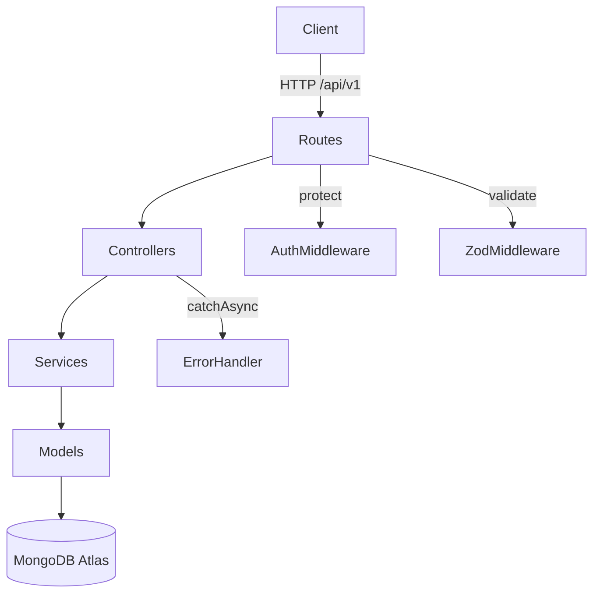

---

## High-Level System

How the client connects to the backend and database:

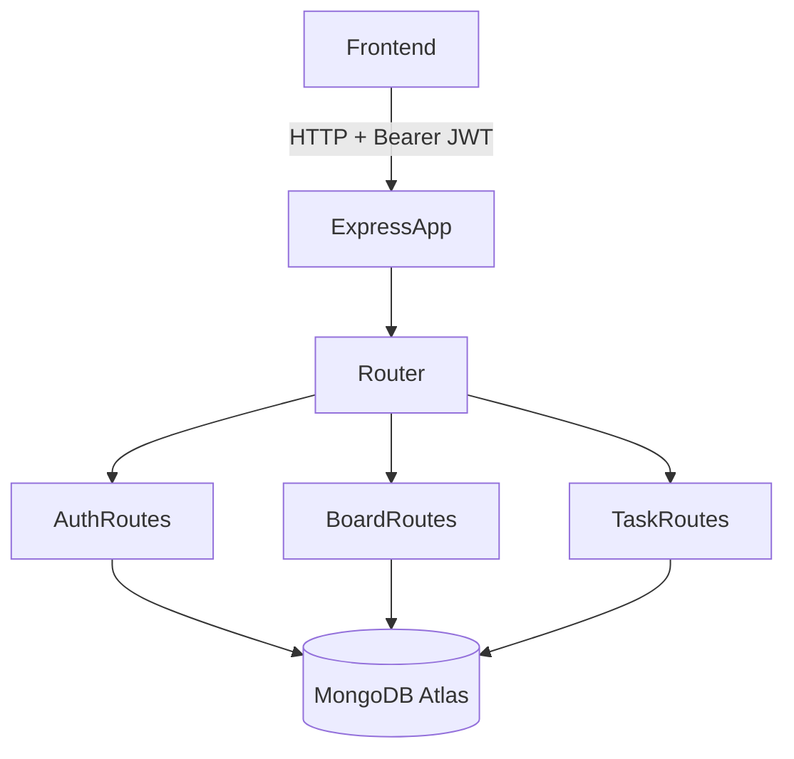

---

## Layered Architecture

Each HTTP request flows through four distinct layers. **No layer skips another** — controllers never query the database directly, and services never touch `req` or `res`.

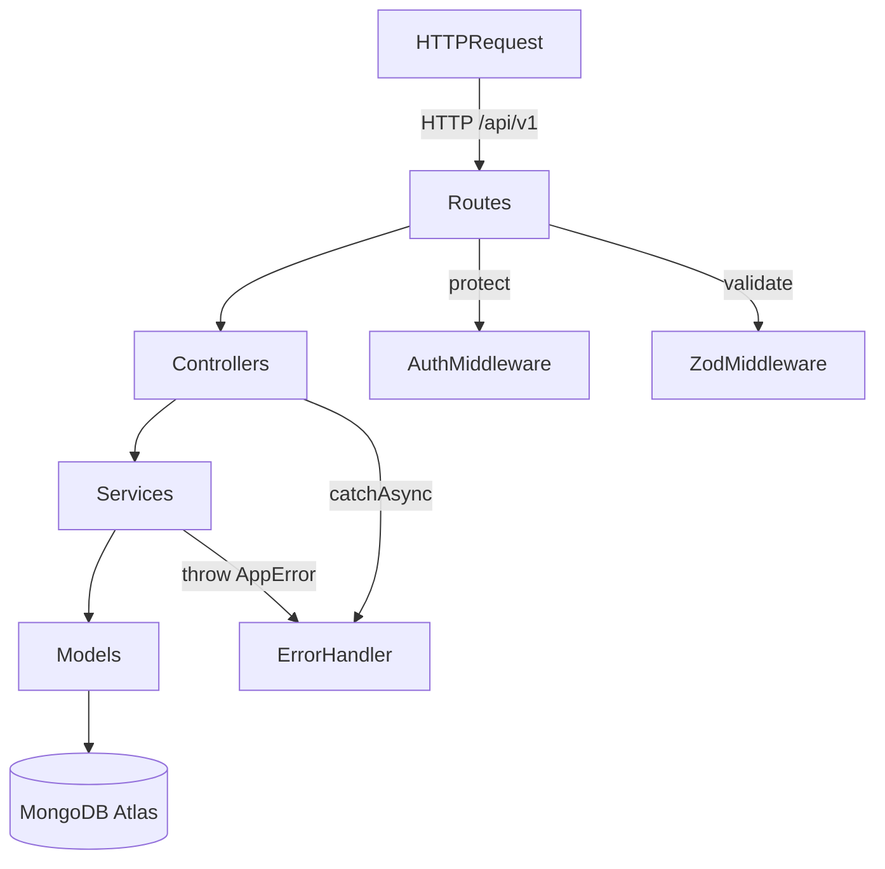

### Why This Matters

| Benefit | Example |
|---------|---------|
| **Testability** | `auth.service.js` can be unit-tested without Express or MongoDB |
| **Reusability** | Socket.IO handlers (Day 8) will call the same service functions as HTTP controllers |
| **Maintainability** | Changing a MongoDB query only touches the service layer |
| **Security** | Authorization logic lives in services, not scattered across routes |

---

## Request Lifecycle

A typical protected API call (e.g., `GET /api/v1/boards/:id`):

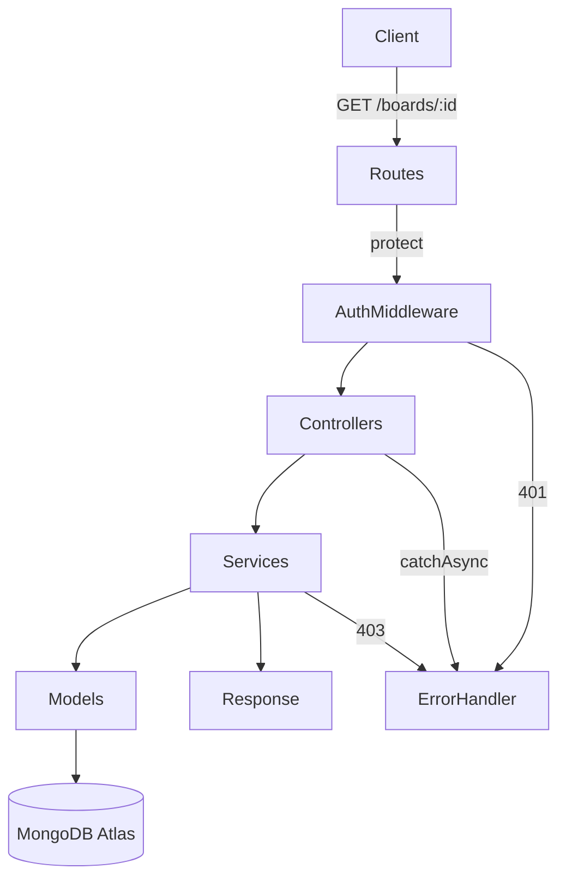

---

## Express Middleware Stack

Middleware runs **in order** — defined in `app.js`:

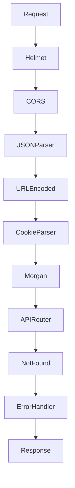

---

## Database Schema

Three collections form the core data model. Tasks embed comments and subtasks; boards embed member lists.

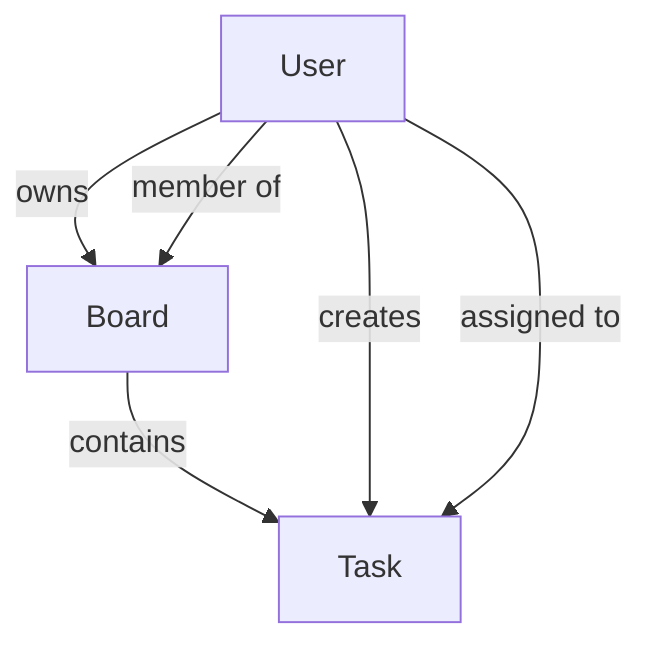

### Key Indexes

| Collection | Index | Purpose |
|------------|-------|---------|
| `users` | `{ email: 1 }` unique | Fast login lookup |
| `users` | `{ oauthProvider, oauthId }` | OAuth login (future) |
| `boards` | `{ owner, createdAt }` | Dashboard: user's boards, newest first |
| `boards` | `{ members.user }` | Find boards where user is a member |
| `tasks` | `{ board, column, order }` | **Critical** — Kanban column load + sort |
| `tasks` | `{ assignees }` | "Tasks assigned to me" |
| `tasks` | `{ board, aiGenerated }` | AI-generated task panel (Day 12) |

---

## Authentication System

OmniFlow uses a **dual-token JWT strategy** — short-lived access tokens for API calls and long-lived refresh tokens stored in HttpOnly cookies.

### Register / Login Flow

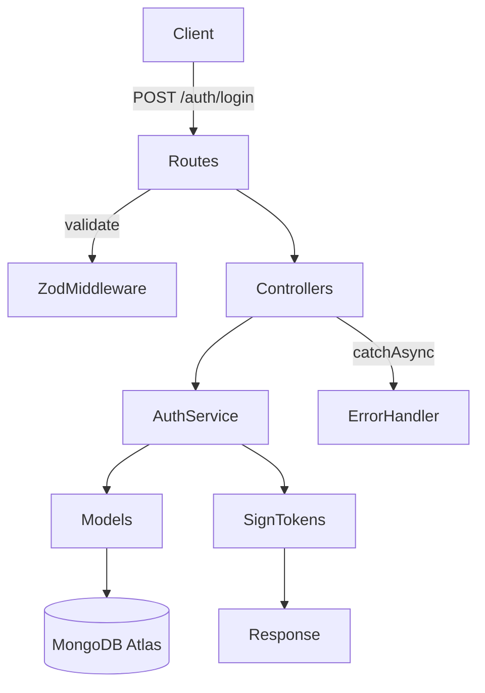

### Protected Request Flow

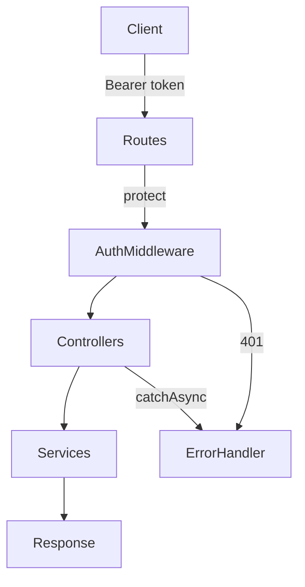

### Token Refresh Flow

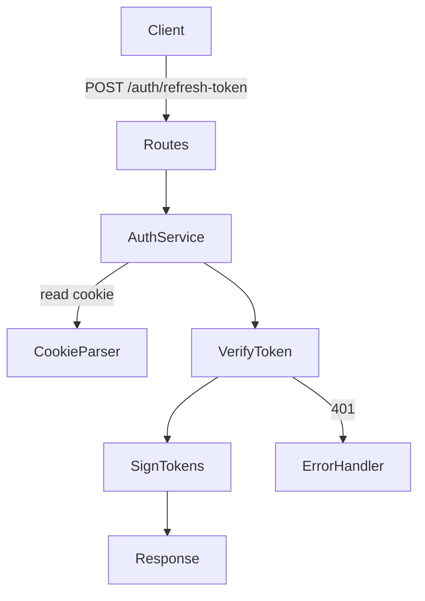

### Logout Flow

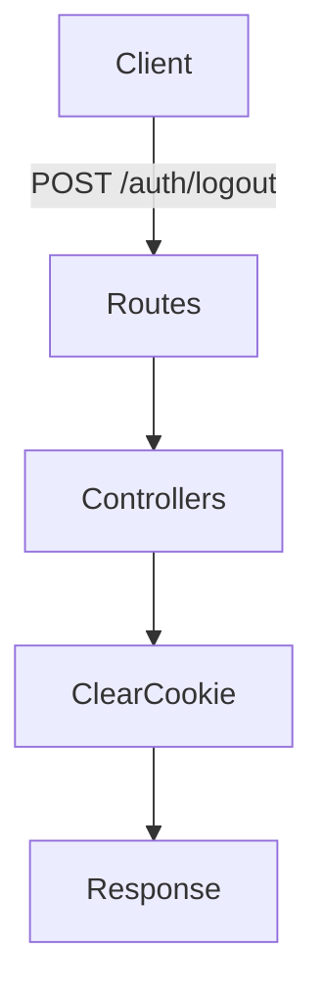

### Token Storage Strategy

| Token | Lifespan | Storage | Readable by JS? | Purpose |
|-------|----------|---------|-----------------|---------|
| **Access** | 15 minutes | Frontend memory (Zustand) | Yes | Attach to `Authorization` header |
| **Refresh** | 7 days | HttpOnly cookie | No (XSS-safe) | Get new access token silently |

### `protect` Middleware Checks

Every protected route runs five checks before granting access:

1. Extract `Bearer` token from `Authorization` header
2. Verify JWT signature and expiry
3. Fetch user from DB (confirms account still exists)
4. Confirm account is active (`isActive: true`)
5. Check `changedPasswordAfter(jwt.iat)` — invalidates tokens after password change

---

## Authorization Model

OmniFlow has **two levels** of authorization:

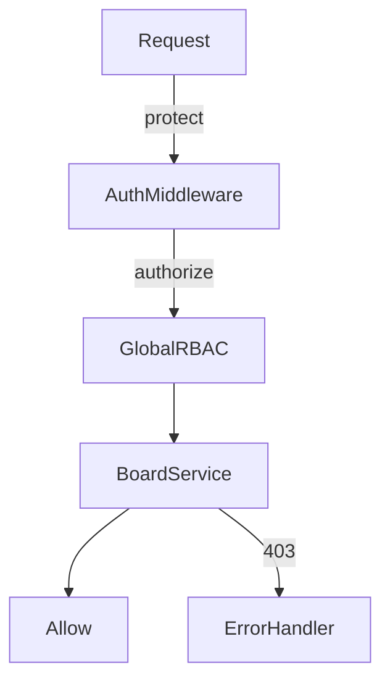

| Action | Who Can Do It |
|--------|---------------|
| View board | Owner or any member |
| Update board | Owner or member with `admin` role |
| Delete board (soft) | Owner or member with `admin` role |
| Create/update/move/delete tasks | Owner or any member |
| Global admin routes | User with `role: admin` (via `authorize` middleware) |

---

## Kanban Drag-and-Drop Logic

Tasks have an `order` integer within each `column`. When a card is dragged, the frontend calls `POST /api/v1/tasks/:id/move` with `{ targetColumn, newOrder }`.

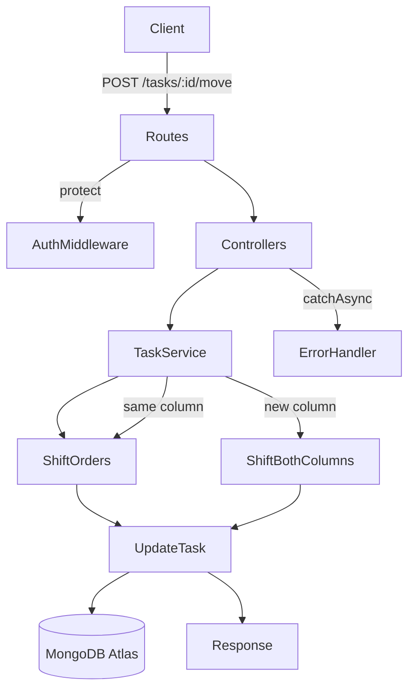

This keeps order values sequential with no gaps or overlaps, so the frontend can render columns with a simple `sort({ order: 1 })`.

---

## Error Handling

All errors funnel through a single `globalErrorHandler`. Controllers use `catchAsync` so thrown errors never crash the server.

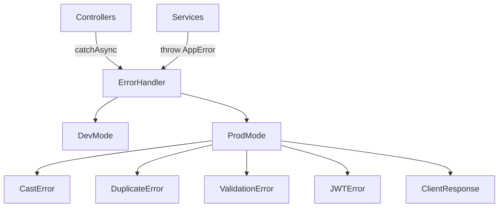

### Error Response Format

```json
{
  "status": "fail",
  "message": "You do not have permission to access this board"
}
```

Operational errors (`AppError` with `isOperational: true`) are safe to show users. Programming bugs return a generic 500 in production.

---

## API Reference

Base URL: `http://localhost:5000/api/v1`

### Auth — `/auth`

| Method | Path | Auth | Description |
|--------|------|------|-------------|
| `POST` | `/auth/register` | Public | Create account → access token + refresh cookie |
| `POST` | `/auth/login` | Public | Login → access token + refresh cookie |
| `POST` | `/auth/logout` | Public | Clear refresh token cookie |
| `POST` | `/auth/refresh-token` | Public | Exchange refresh cookie for new access token |
| `GET` | `/auth/me` | Protected | Current user profile |
| `PATCH` | `/auth/change-password` | Protected | Change password, re-issue tokens |

### Boards — `/boards`

| Method | Path | Auth | Description |
|--------|------|------|-------------|
| `GET` | `/boards` | Protected | List boards (owner or member) |
| `POST` | `/boards` | Protected | Create board |
| `GET` | `/boards/:id` | Protected | Get single board |
| `PATCH` | `/boards/:id` | Protected | Update board (owner/admin member) |
| `DELETE` | `/boards/:id` | Protected | Soft-delete board (owner/admin member) |

### Tasks — `/tasks`

| Method | Path | Auth | Description |
|--------|------|------|-------------|
| `GET` | `/tasks?board=<id>` | Protected | List tasks for a board |
| `POST` | `/tasks` | Protected | Create task (body includes `board`, `column`) |
| `GET` | `/tasks/:id` | Protected | Get single task |
| `PATCH` | `/tasks/:id` | Protected | Update task fields |
| `POST` | `/tasks/:id/move` | Protected | Drag-and-drop reorder |
| `DELETE` | `/tasks/:id` | Protected | Soft-delete task |

### Utility

| Method | Path | Description |
|--------|------|-------------|
| `GET` | `/health` | Server health check (Docker/CI) |
| `GET` | `/api/v1` | API version info |

---

## Project Structure

```
omniflow-backend/
├── src/
│   ├── config/
│   │   ├── index.js              # Env validation, exported config object
│   │   └── database.js           # connectDB() with reconnection listeners
│   ├── models/
│   │   ├── user.model.js         # Auth, bcrypt hook, comparePassword()
│   │   ├── board.model.js        # Members, columns, indexes
│   │   └── task.model.js         # Order, comments, subtasks, AI fields
│   ├── middlewares/
│   │   ├── auth.middleware.js    # protect + authorize
│   │   ├── validate.middleware.js # Zod validation factory
│   │   └── error.middleware.js   # Global error handler
│   ├── services/
│   │   ├── auth.service.js       # register, login, refresh, changePassword
│   │   ├── board.service.js      # Board CRUD + board-level RBAC
│   │   └── task.service.js       # Task CRUD + moveTask reorder logic
│   ├── controllers/
│   │   ├── auth.controller.js    # Thin HTTP handlers
│   │   ├── board.controller.js
│   │   └── task.controller.js
│   ├── routes/
│   │   ├── index.js              # Master router (/auth, /boards, /tasks)
│   │   ├── auth.routes.js
│   │   ├── board.routes.js
│   │   └── task.routes.js
│   ├── utils/
│   │   ├── AppError.js           # Custom error class
│   │   ├── catchAsync.js         # Async wrapper for controllers
│   │   ├── jwt.js                # signAccessToken, signRefreshToken, verifyToken
│   │   └── validators.js         # Zod schemas
│   ├── scripts/
│   │   └── seed.js               # Schema verification script
│   ├── app.js                    # Express configuration (no server listen)
│   └── server.js                 # Entry point: connectDB → listen → graceful shutdown
├── package.json
└── .env                          # Secrets (never committed)
```

---

## Server Startup & Shutdown

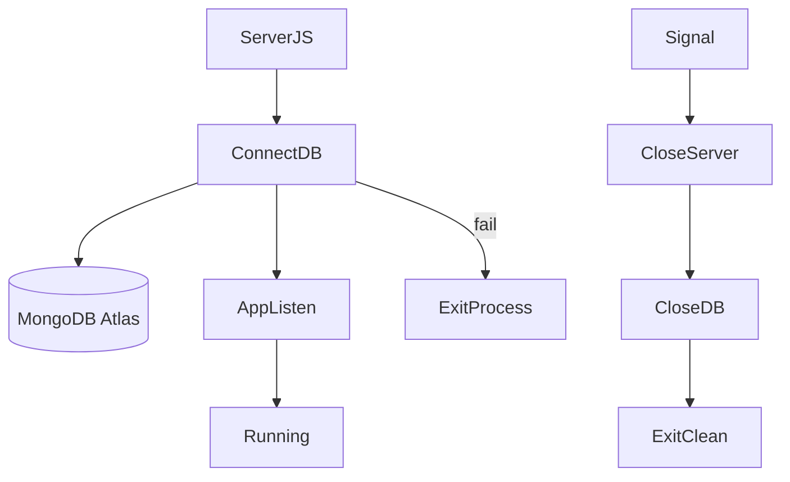

---

## Running Locally

```bash
cd omniflow-backend
npm install
# Configure .env with PORT, MONGO_URI, JWT_SECRET
npm run dev          # Development with --watch
npm run seed         # Verify schemas against MongoDB
```

Required environment variables:

```
PORT=5000
NODE_ENV=development
MONGO_URI=mongodb+srv://...
JWT_SECRET=your-secret-key
JWT_EXPIRES_IN=15m
JWT_REFRESH_EXPIRES_IN=7d
```

---

## How Phase 2 Will Use This Backend

Phase 2 (Days 5–7) builds the **Next.js frontend** that consumes the API created here:

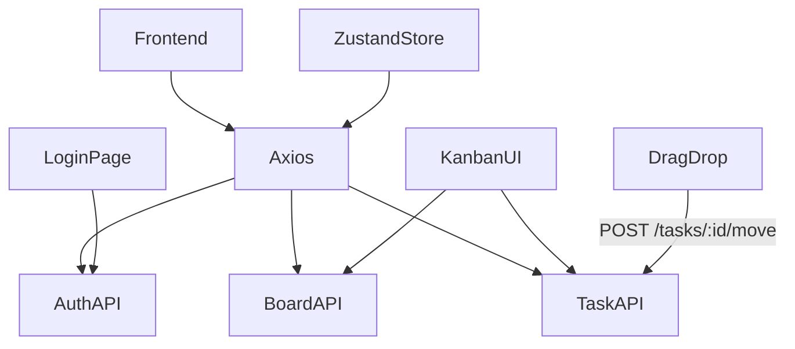

| Phase 2 Feature | Phase 1 Dependency |
|-----------------|-------------------|
| Login/Register pages | `POST /auth/register`, `/auth/login` |
| Stay logged in | `POST /auth/refresh-token` + HttpOnly cookie |
| Board list dashboard | `GET /boards` |
| Kanban columns | `GET /tasks?board=<id>`, board `columns` field |
| Drag-and-drop | `POST /tasks/:id/move` with `{ targetColumn, newOrder }` |
| CORS + credentials | Already configured in `app.js` for `localhost:3000` |

---

## What's Next

| Phase | Days | Focus |
|-------|------|-------|
| **Phase 2** | 5–7 | Next.js frontend, Zustand, Kanban UI, Tailwind |
| **Phase 3** | 8–10 | Socket.IO real-time sync, Cloudinary uploads, Redis caching |
| **Phase 4** | 11–12 | BullMQ job queues, OpenAI task generation |
| **Phase 5** | 13–15 | Jest/Supertest, Docker, GitHub Actions CI/CD |

---

*Phase 1 complete. The backend is ready for the frontend to connect.*
